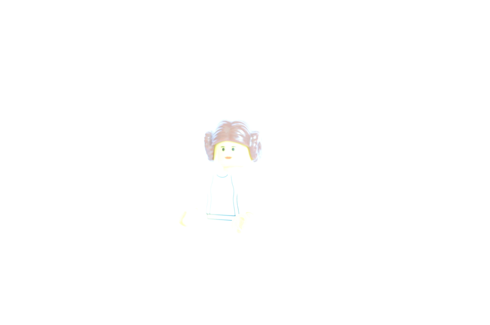
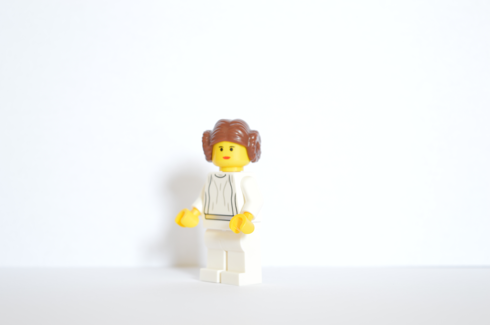

Changing settings on manual to change the

#### Photos

| Shutter Speed | Aperture | ISO | Photo | Note |
| ---- | ---- | --- | --- | --- |
| 1/25 | f25 | 100 |  | |
| 1/10 |f25 | 100 |  | |
| 1/10 | f10 | 100 |  | |
| 1/2 | f10 | 100 |  | |
| 1/800 | f10 100 | |  | Under exposed |
| 1/2 | f20 | 100 |  | |
| 1/2 | f36 | 100 |  | |
| 1/2 | f36 | 6400 |  | |
| 1/2 | f10 | 6400 |  | |
| 5" | f5.6 | 100 |  | Over exposed |
| 1" | f5.6 | 100 |  | |
| 1/2 | f5.6 | 100 |  | |
